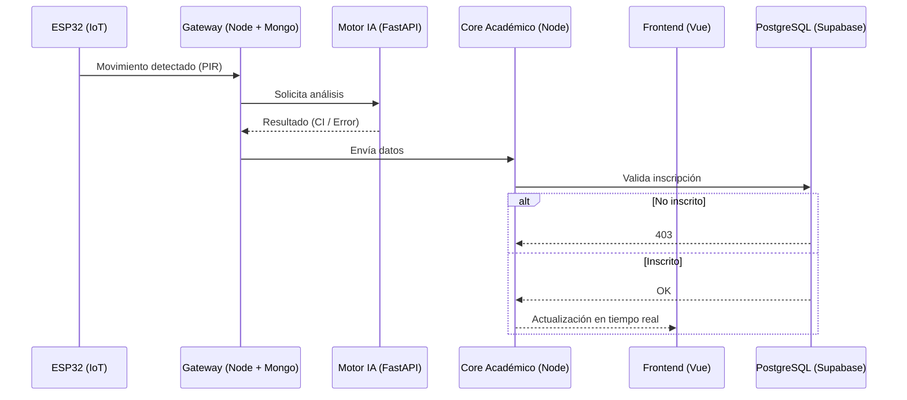

# 🎓 AttendFi - Sistema Inteligente de Asistencia IoT con Reconocimiento Facial

---

## 📌 Descripción

**AttendFi** es una plataforma de gestión académica y seguridad que automatiza el registro de asistencia en aulas mediante:

- Internet de las Cosas (IoT)
- Visión Computacional (IA)
- Arquitectura de microservicios en tiempo real

El sistema reduce errores humanos, elimina procesos manuales y permite monitoreo en vivo del aula.

---

## 🚀 Arquitectura del Sistema

El sistema está basado en **microservicios desacoplados** desplegados con Docker:

- **Capa Edge (IoT):** Captura de eventos físicos  
- **Gateway (Node.js):** Procesamiento inicial y mensajería  
- **Motor IA (FastAPI):** Reconocimiento facial  
- **Core Académico (Node.js):** Lógica de negocio  
- **Frontend (Vue 3):** Interfaz por roles  

**Características:**

- ✔ Alta escalabilidad  
- ✔ Baja latencia  
- ✔ Resiliencia ante fallos  

---

## 📊 Flujo del Sistema

## 🔌 1. Capa IoT (Hardware Gatillo)

**Dispositivo:** ESP32 + Sensor PIR  + LED RGB + Cámara IP

### Lógica en el Borde:
- Sincronización con NTP  
- Consulta de horarios (HTTP GET)  
- Validación local (Edge Computing)  
- Envío de eventos (HTTP POST)
- Feedback visual mediante LED   

### Rol:
Actúa como un gatillo inteligente que:
- Detecta movimiento  
- Verifica si hay clase activa  
- Envía un evento JSON ligero al servidor  

---

## 🧠 2. Capa de Microservicios (Backends)

### 🚦 IoT Gateway & Log Broker
- Node.js + MongoDB + Socket.IO  
- Orquestador central  
- Recibe alertas del hardware
- Guarda histórico en MongoDB  
- Emite eventos en tiempo real vía WebSockets  

### 🧠 Motor de IA
- FastAPI + Python + InsightFace + OpenCV  
- Procesa video desde una cámara IP (tablet)  
- Extrae frames y realiza reconocimiento facial  

**Maneja estados:**
- NoFace  
- Desconocido
- Reconocido 

### 🏛️ Core Académico
- Node.js + Express + Supabase (PostgreSQL)  
- Aplica reglas de negocio
- Gestión de alumnos, materias y asistencias 
- Valida inscripciones con INNER JOIN  
- Evita duplicados  
- Emite actualizaciones al frontend docente  

---

## 💻 3. Capa de Interfaces (Frontends)

### 👨‍🏫 Front Académico
- Vue.js 3  
- Panel para docentes  
- Estadísticas de asistencia  
- Gráficos de torta dinámicos (CSS puro)
- Eventos IoT
- Visualización con Chart.js  

---
## 🔒 Seguridad

### Comunicación
- API REST (JSON)  
- Manejo de errores y timeouts  

### Autenticación
- JWT (Bearer Token)  
- Control de acceso por roles  

### Base de Datos
- Row Level Security (RLS)  
- Restricción por usuario docente

---

## 🛠️ Tecnologías y Stack

- **Hardware:** ESP32 (MicroPython), Sensor PIR  
- **IA:** Python 3, FastAPI, InsightFace, OpenCV  
- **Backend:** Node.js, Express, Socket.IO  

### Base de Datos:
- Supabase (PostgreSQL) → datos transaccionales  
- MongoDB → registros históricos  

- **Frontend:** Vue.js 3, Vite, Socket.IO-client  

---

## 🔄 Flujo Resumido

1. ESP32 detecta movimiento  
2. Validación local de horario  
3. Envío de evento al Gateway  
4. Reconocimiento facial (IA)  
5. Registro de log en MongoDB  
6. Validación de inscripción  
7. Registro de asistencia  
8. Actualización en tiempo real en frontend

---

## 👥 Equipo

Proyecto desarrollado en la  
**Universidad Católica Boliviana "San Pablo"**  
Carrera: Ingeniería de Sistemas  

- Adriana Alvarez  
- Adrian Gonzales  
- Diego Laguna  
- Adrián Ordóñez  

---
    
