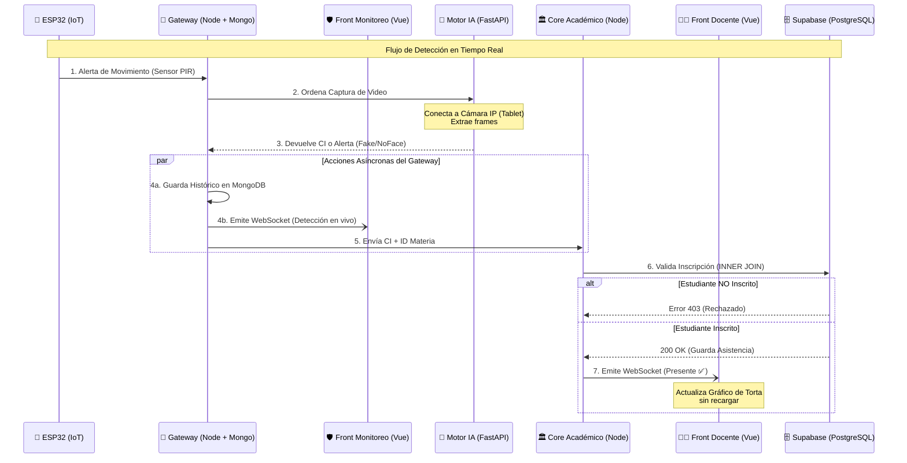

# 🎓 AttendFi - Sistema Inteligente de Asistencia IoT y Reconocimiento Facial

---

AttendFi es una plataforma integral de gestión académica y seguridad diseñada para automatizar el registro de asistencias mediante **Internet de las Cosas (IoT)**, **Visión Computacional (IA)** y una **arquitectura de microservicios en tiempo real**.

Este proyecto evoluciona conceptos de gestión académica para integrar hardware y redes neuronales en un ecosistema robusto, escalable y eficiente.

---

## 🚀 Arquitectura del Sistema

El sistema opera bajo un modelo de **microservicios distribuidos**, separando:

- Captura de hardware  
- Procesamiento de IA  
- Reglas de negocio académicas  

Esto permite **alta escalabilidad** y **baja latencia**.

---

## 📊 Flujo del Sistema

## 🔌 1. Capa IoT (Hardware Gatillo)

**Dispositivo:** ESP32 + Sensor PIR  

### Lógica en el Borde:
- Descarga el horario del día (UTC-4)  
- Lo almacena en caché para evitar peticiones innecesarias  

### Rol:
Actúa como un gatillo inteligente que:
- Detecta movimiento  
- Verifica si hay clase activa  
- Envía un evento JSON ligero al servidor  

---

## 🧠 2. Capa de Microservicios (Backends)

### 🚦 IoT Gateway & Log Broker
- Node.js + MongoDB + Socket.IO  
- Orquestador central  
- Recibe alertas del ESP32  
- Guarda histórico en MongoDB  
- Emite eventos en tiempo real vía WebSockets  

### 🧠 Motor de IA
- FastAPI + Python + InsightFace + OpenCV  
- Procesa video desde una cámara IP (tablet)  
- Extrae frames y realiza reconocimiento facial  

**Maneja estados:**
- NoFace  
- Desconocido
- Reconocido 

### 🏛️ Core Académico
- Node.js + Supabase (PostgreSQL)  
- Aplica reglas de negocio  
- Valida inscripciones con INNER JOIN  
- Evita duplicados  
- Emite actualizaciones al frontend docente  

---

## 💻 3. Capa de Interfaces (Frontends)

### 👨‍🏫 Front Académico
- Vue.js 3  
- Panel para docentes  
- Estadísticas de asistencia  
- Gráficos de torta dinámicos (CSS puro)  

### 🛡️ Front de Monitoreo
- Vue.js 3  
- Dashboard en tiempo real  
- Logs de detecciones  
- Estado del sistema  

---

## 🛠️ Tecnologías y Stack

- **Hardware:** ESP32 (MicroPython), Sensor PIR  
- **IA:** Python 3, FastAPI, InsightFace, OpenCV  
- **Backend:** Node.js, Express, Socket.IO  

### Base de Datos:
- Supabase (PostgreSQL) → datos transaccionales  
- MongoDB → registros históricos  

- **Frontend:** Vue.js 3, Vite, Socket.IO-client  

---

## 🔄 Flujo de Trabajo

### 1. Sincronización:
El ESP32 obtiene las clases del día desde el Gateway  

### 2. Detección:
El sensor PIR detecta movimiento y determina la materia actual  

### 3. Análisis:
FastAPI captura video, reconoce al usuario y devuelve el CI  

### 4. Seguridad:
El Gateway guarda el evento en MongoDB y actualiza monitoreo  

### 5. Registro:
Se valida la inscripción en Supabase y se registra la asistencia  

### 6. Actualización:
WebSocket actualiza el frontend docente en tiempo real  
    end
